# Active Directory - Setting up & Implementing Group Policy Objects (GPOs) 
## Description

An Active Directory homelab exercise demonstrating how to configure, deploy, and enforce essential Group Policy Objects (GPOs) across a domain environment. This lab covers key administrative security controls, system hardening, user experience standardization, and drive mapping to establish a secure and standardized Active Directory domain structure.

## Environment Used

- Windows Server 2022
- VMware Workstation
- Windows 10 Pro / Enterprise

## 

## Active Directory - Password Policy
### Description

An Active Directory homelab exercise demonstrating how to configure and enforce Domain Password Policies using Group Policy Objects (GPOs). This lab covers creating a new custom GPO, 
configuring account policy rules—including minimum password length, complexity requirements, minimum password age, and maximum password age—and verifying the updated policy settings in the Group Policy Management Editor.

## Lab walk-through

Launch the Group Policy Management console to view the forest and domain structure.
  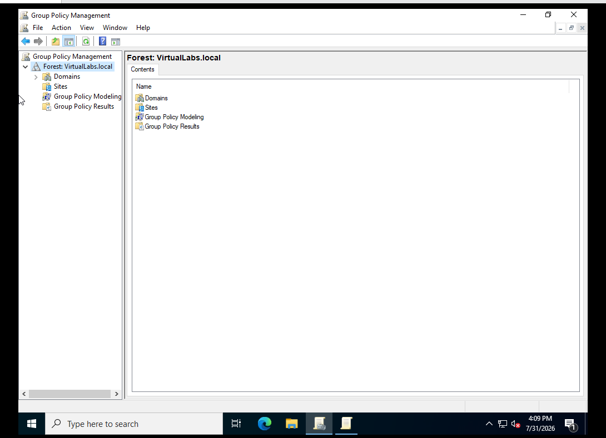

Create a new Group Policy Object named "Password Policy" in the domain.
  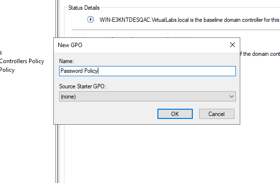

 Navigate to Computer Configuration > Policies > Windows Settings > Security Settings >   Account Policies > Password Policy in the Group Policy Management Editor.
  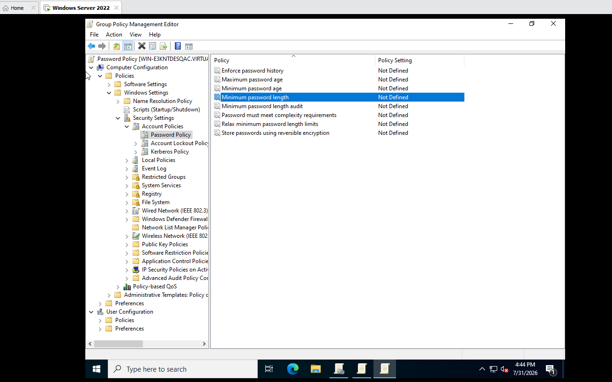

  Configure the Minimum password length policy setting to require at least 12 characters.
  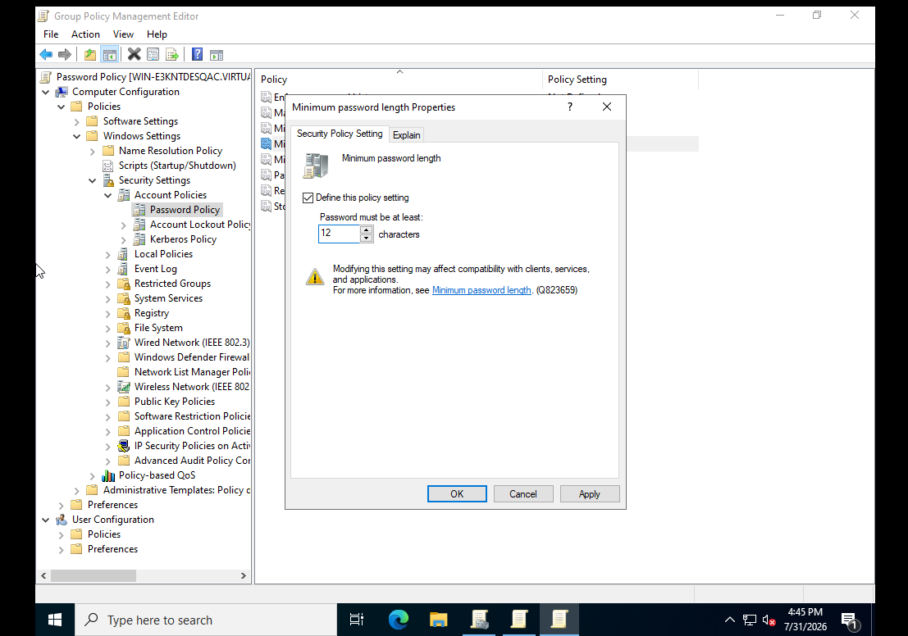

 
  Enable the Password must meet complexity requirements policy setting.
  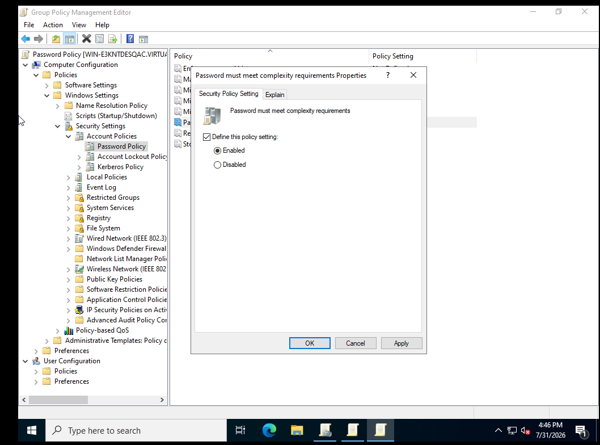

 Configure the Minimum password age setting so passwords must be kept for at least 30 days before changing.
  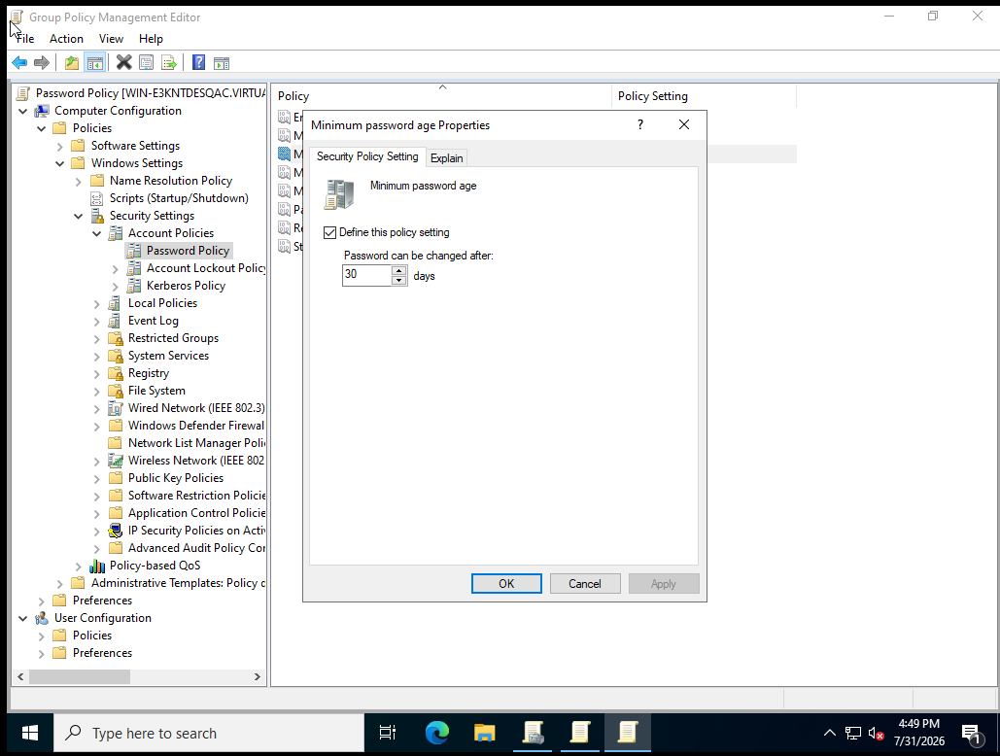

 
  Configure the Maximum password age setting to require a password expiration every 90 days.
  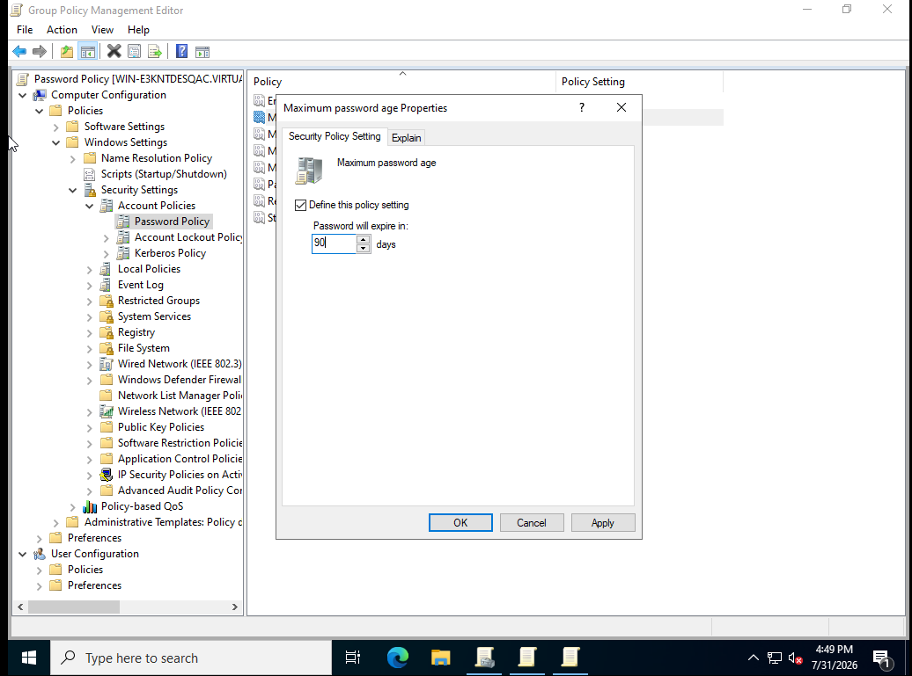

  Verify the final Password Policy settings summary in the Group Policy Management Editor.
  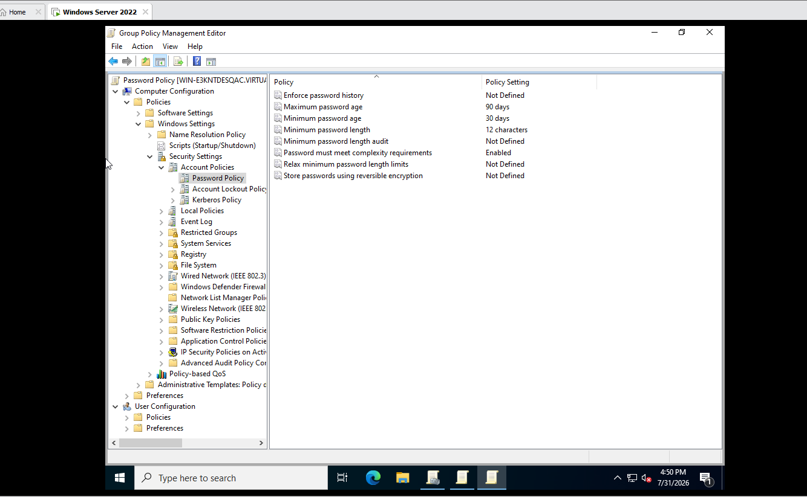

## Testing & Implementing

 Executed gpupdate /force on client workstations via Command Prompt / PowerShell to pull updated GPOs immediately.
  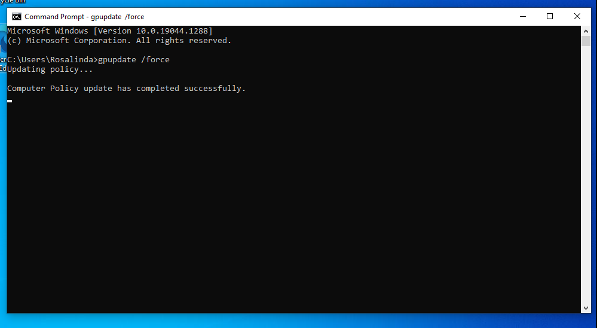

 Configures domain-wide account security rules, including minimum password length, complexity requirements, minimum/maximum password age, and account lockout thresholds.
  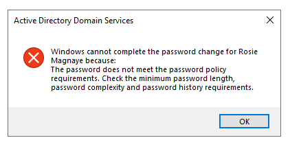

# 

## Active Directory - Drive mapping
### Description

An Active Directory homelab exercise demonstrating how to automatically map network drives to domain users using Group Policy Preferences. This lab covers creating a custom GPO for Drive Mapping, navigating to User Configuration preferences, configuring a new mapped drive path using UNC notation, assigning drive letters, and verifying the mapped drive configuration.

## Lab walk-through

Create a new Group Policy Object named "Drive Mapping" within the Group Policy Management console.
  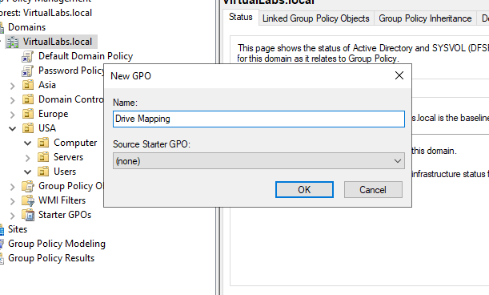

Open the Group Policy Management Editor and navigate to User Configuration > Preferences > Windows Settings > Drive Maps.
  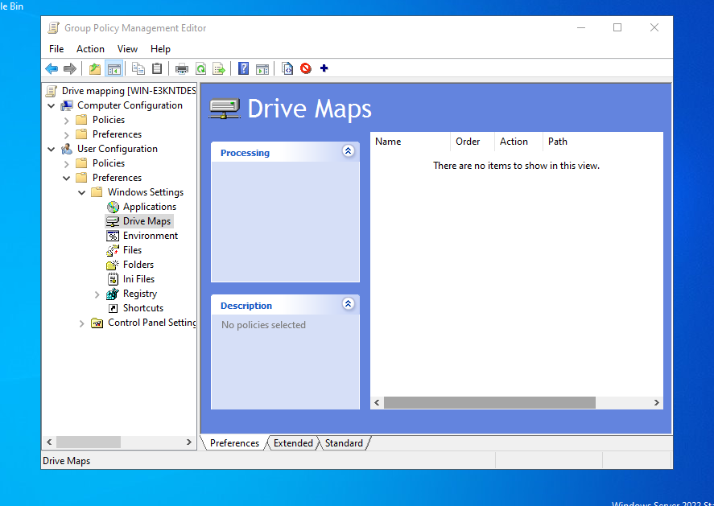

 Configure a new drive mapping by setting the action to Update, specifying the network share location (\\servername\folder), and assigning the drive letter D:.
  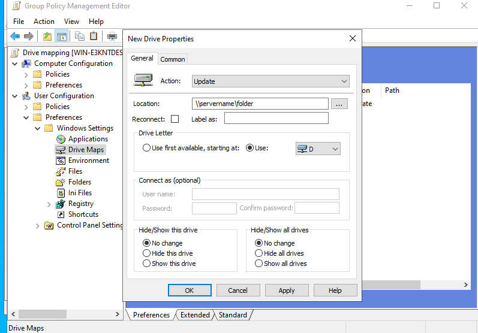

 
Confirm that the new drive map entry is listed and enabled in the Drive Maps preference console.  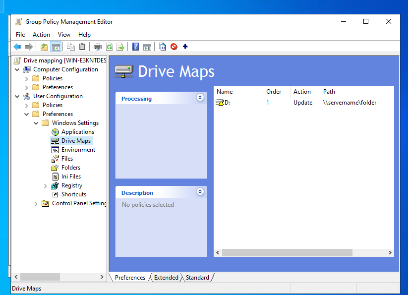

# 

## Active Directory - 
### Description

An Active Directory homelab exercise demonstrating how to automatically map network drives to domain users using Group Policy Preferences. This lab covers creating a custom GPO for Drive Mapping, navigating to User Configuration preferences, configuring a new mapped drive path using UNC notation, assigning drive letters, and verifying the mapped drive configuration.

## Lab walk-through

Create a new Group Policy Object named "Drive Mapping" within the Group Policy Management console.
  

Open the Group Policy Management Editor and navigate to User Configuration > Preferences > Windows Settings > Drive Maps.
  

 Configure a new drive mapping by setting the action to Update, specifying the network share location (\\servername\folder), and assigning the drive letter D:.
  

 
Confirm that the new drive map entry is listed and enabled in the Drive Maps preference console.  

